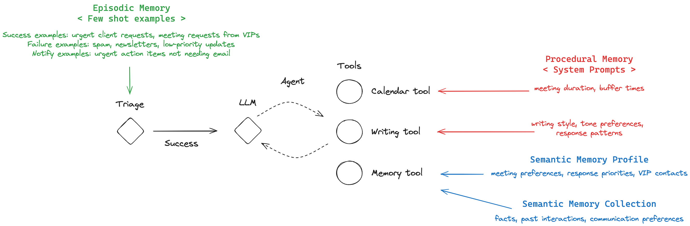

# Long-Term Memory Course

## Motivation 

TO ADD 

## End result

TO ADD 



## Organization of the course

The first lesson is a conceptual introduction (slides [here](https://docs.google.com/presentation/d/1zdVyTUydRkgrSx_ZzlNuuKYapy6dTkHKkqYLdcxtTIQ/edit?usp=sharing)) to the different types of memories that we will use in this course.

The lessons are shown in the `notebooks` folder, structured as follows:

```
- Lesson 2: Baseline Email Assistant
- Lesson 3: Adding Semantic Memory
- Lesson 4: Adding Episodic Memory
- Lesson 5: Adding Procedural Memory
- Lesson 6: Deploying the App
```

## Running the Application

TODO