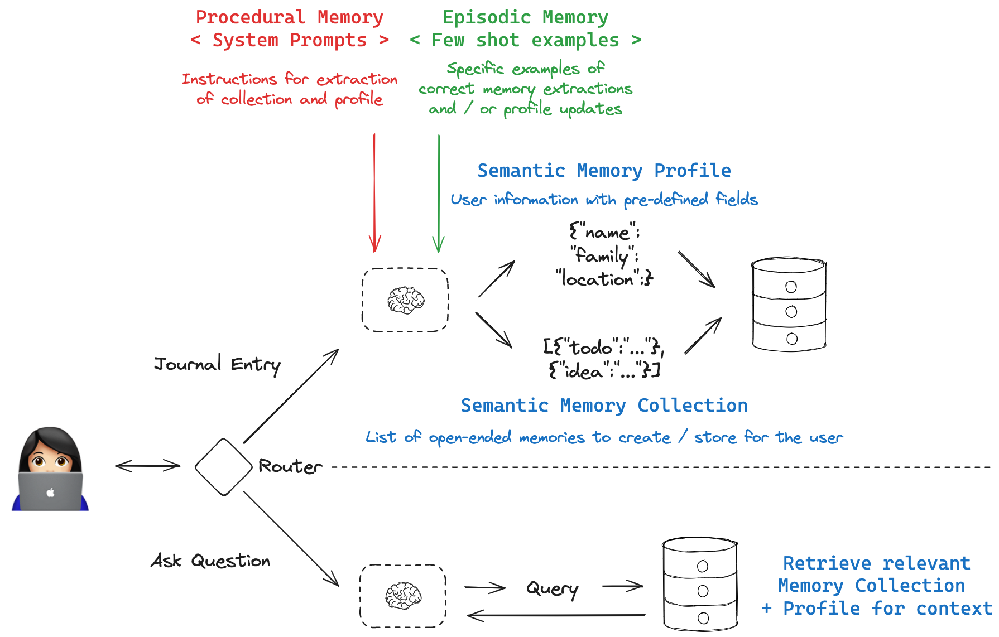

# Long-Term Memory Course

## Motivation 

Memory in LLM applications enables structured extraction and organization of information over time. A practical example is [AI-assisted journaling](https://x.com/patrick_oshag/status/1876455619516911720), where an LLM can extract structured data (sentiment, focus topics, action items) from unstructured journal entries. This course is a step-by-step guide to building an LLM-assisted journaling app using LangGraph that 1) gives you an actual application that you can deploy (even locally for private use) and 2) shows you the different types of memories that you can use in AI applications.

## End result

We'll build an app that looks like this, allowing you to journal and have the AI extract structured data from your journal entries for later retrieval / analysis.



## Organization of the course

The lessons are shown in the `notebooks` folder, structured as follows:

```
- Lesson 1: Concepts
- Lesson 2: Procedural Memory
- Lesson 3: Episodic Memory
- Lesson 4: Semantic Memory Collection
- Lesson 5: Semantic Memory Profile
- Lesson 6: Building the App
```

These give you the conceptual foundations for the app in interactive notebooks for exploration and experimentation. The final code needed to run the resulting application is shown in `src/memory_course/` folder, which can be run as a standalone application using [LangGraph server](https://langchain-ai.github.io/langgraph/concepts/langgraph_server/). 

## Running the Application

TODO