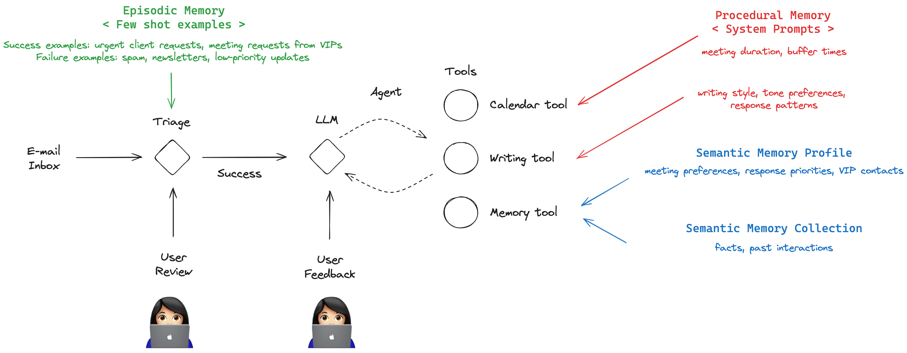

# Concept Overview (WIP / Outline)

### Slide 1: The Challenge of Email Management

- Email management is a common pain point
- Information overload leads to:
  - Missed important messages
  - Delayed responses
  - Poor prioritization
  - Calendar scheduling difficulties

### Slide 2: Email Assistant

An AI email assistant:
- Triage incoming emails
- Draft responses
- Manage calendar

### Slide 3: Types of Memory

[Three key types of memory in cognitive systems:](https://en.wikipedia.org/wiki/Long-term_memory)

### Slide 4: Semantic Memory

1. **Semantic Memory**
   - Facts and knowledge
   - Understanding relationships
   - General concepts

### Slide 5: Episodic Memory

2. **Episodic Memory**
   - Specific past experiences
   - Context-based learning
   - Historical patterns

### Slide 6: Procedural Memory

3. **Procedural Memory**
   - Skills and procedures
   - How to perform tasks
   - Learned behaviors

### Slide 7: Mapping this to AI systems

https://arxiv.org/abs/2309.02427

Semantic memories can be [organized into collections or a fixed profile](https://langchain-ai.github.io/langgraph/concepts/memory/#semantic-memory). 

### Slide 9: Hot path

### Slide 10: Background memory

### Slide 11: Mapping Memory Types to Email Assistant

1. **Semantic Memory** → User Profile & Facts
   - Contact information
   - Preferences
   - Important relationships
   - Regular commitments

2. **Episodic Memory** → Email Triage
   - Past email interactions
   - Previous handling of similar messages
   - Meeting history
   - Response patterns

3. **Procedural Memory** → Email Actions
   - Email drafting templates
   - Calendar scheduling procedures
   - Response workflows
   - Priority handling rules
